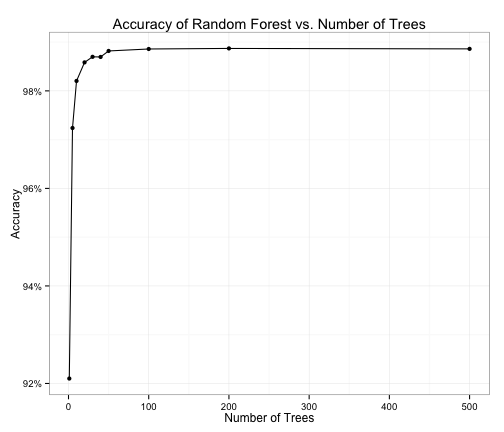

Predicting How Well Weight Lifting Exercise is Performed
========================================================

The data set is provided by http://groupware.les.inf.puc-rio.br/har (see [1]). The data comprises of the measurements from sensors installed on the belt, forearm, arm and dumbell of 6 participants during weight-lifting exercise. Sensors include accelerometer, gyroscope and magnetometer. The participants performed the exercise in 5 different ways: one correct and four incorrect. The purpose of this analysis is to build the model that can predict the manner in which exercise is performed using data from sensors.

Data Processing
--------------------------------------------------------


```r
df <- read.csv("pml-training.csv")
columns <- grep("^(roll_|pitch_|yaw_|total_accel_|gyros_|accel_|magnet_)", colnames(df))
df.obs <- df[, c(160, columns)]
```

The data contains the following measurements from each sensor:
 * Orientation using three Euler angles: roll, pitch and yaw
 * Acceleration along each of three axis  and total acceleration
 * Rotation velocity along each of three axis using
 * Magnetic field along each axis

Additionally the data contains columns with summary statistics for each of the Euler angles from each sensor. This statistics includes mean, variance, standard deviation, max, min, amplitude, kurtosis and skew. These summary columns have data available only when the new observation window starts. There are 406 observation windows that in total include 19622 observations. 

This statistical learning analysis includes only raw measurments from sensors and Euler angles for each time step. All summary variables are excluded as specified in the next section. It is done by selection only the columns which names start with "roll", "pitch", "yaw", "total_accel", "gyro", "accel", "magnet" and the exercise quality (outcome) column.

After removing summary variables there are 52 numerical variable available for analysis as predictors and one outcome variable represented as factor with five levels - one per each quality type of weight lifting. 

The number of complete cases in the data is 19622 out of total 19622 observations. It means that there is no missing values in the data that is used to build the prediciton model.


Prediction Model
-----------------------------------------------------------------------------

There are two types of predictor variables that can be used to build the prediction model:
 * Raw measurements - available at each time step
 * Summary statistics available only at one row per observation window.

One possibility is to build two separate models: one for each type of predictors, and then combine them using model stacking. However the prediction model built here will be applied to another testing set that contains only 20 instantenious observations and does not contain full observation windows. Due to this practical reason only the raw measurments daa will be used to build the machine learning algorithm.

We need to predict which of five exercise quality types the current data point belongs to. This is a classification problem. One of the most accurate prediction methods for classification problems is Random Forest. This method constructs multiple decision trees based on randomly selected predictors and then use all those decisions trees to come up with the final prediction. The data set is balanced in terms of different outcomes, so it should not reduce the performance of the Random Forest method. The table below shows the number of each outcome in the data set.

```r
table(df$classe)
```

```
## 
##    A    B    C    D    E 
## 5580 3797 3422 3216 3607
```


First step is to split the data into training and testing set by randomly assigning 70% of observations to the training data set and 30% to the testing data set.

```r
set.seed(1357)
inTrain <- createDataPartition(y = df.obs$classe, p = 0.7, list = FALSE)
training <- df.obs[inTrain, ]
testing <- df.obs[-inTrain, ]
```


Next, we use `train` function from the package `caret` to perform the model training using Random Forest method. Random Forest method doesn't need additional cross validation, since it performes out-of-bag error calculations. Thus we don't create a separate validation set. We don't need to center and scale the variables, since the monotone transformations don't change the outcome of the decision tree. By default `train` sets the number of random trees to 500. 

```r
modelFit <- train(classe ~ ., method = "rf", data = training, ntree = 500)
```

The accuracy of the model based on resampling and bootstrapping the training is 0.9886. OOB estimate of error rate is 0.65%

The last step is to apply the prediction model to the testing data set and assess the accuracy of the predicted results.

```r
pred <- predict(modelFit, testing)
confMatrix <- confusionMatrix(pred, testing$classe)
```

The confusion matrix for predicting the quality of the lifting exercise based on the testing set is shown below. It accurately predicted most of the cases.

```
##           Reference
## Prediction    A    B    C    D    E
##          A 1670   16    0    0    0
##          B    4 1118    5    2    1
##          C    0    5 1015   16    1
##          D    0    0    6  945    2
##          E    0    0    0    1 1078
```

The accuracy of the prediction on the test set is:  0.99 with the 95% confidence level [0.9871, 0.9924]. It is very close to the accuracy based on resampling the training data. Sensitivity and specificity for each class is also quite high - 98-99%:

```
##      Accuracy AccuracyLower AccuracyUpper 
##        0.9900        0.9871        0.9924
```


```
##          Sensitivity Specificity
## Class: A      0.9976      0.9962
## Class: B      0.9816      0.9975
## Class: C      0.9893      0.9955
## Class: D      0.9803      0.9984
## Class: E      0.9963      0.9998
```


Appendix. Assessing Accuracy vs. Number of Trees
---------------------------------------

One of the cons of Random Forest method is long running time. By default `randomForest` function generates 500 decision trees. Figure 1 shows how accuracy changes as the function of number of trees. The accuracy plateaus after the number of trees reaches around 50. 


```r
x <- c(1, 5, 10, 20, 30, 40, 50, 100, 200)
modelFits <- lapply(x, function(nt) train(classe ~ ., method = "rf", data = training, 
    ntree = nt))
acc <- sapply(modelFits, function(mf) {
    mtry <- mf$bestTune[1, 1]
    rs <- mf$results
    rs[rs[, 1] == mtry, 2]
})
```


```r
df.acc <- data.frame(ntree = c(x, 500), acc = c(acc, modelFit$results[2, 2]))
g <- ggplot(df.acc, aes(ntree, acc)) + geom_point() + geom_line() + scale_y_continuous(labels = percent) + 
    xlab("Number of Trees") + ylab("Accuracy") + ggtitle("Accuracy of Random Forest vs. Number of Trees") + 
    theme_bw()

print(g)
```

 

Figure 1. Accuracy of Random Forest model for different numbers of trees


References
--------------------------------------------
[1] Velloso, E.; Bulling, A.; Gellersen, H.; Ugulino, W.; Fuks, H. Qualitative Activity Recognition of Weight Lifting Exercises. Proceedings of 4th International Conference in Cooperation with SIGCHI (Augmented Human '13) . Stuttgart, Germany: ACM SIGCHI, 2013.

Read more: http://groupware.les.inf.puc-rio.br/har#ixzz38bAFjD75


